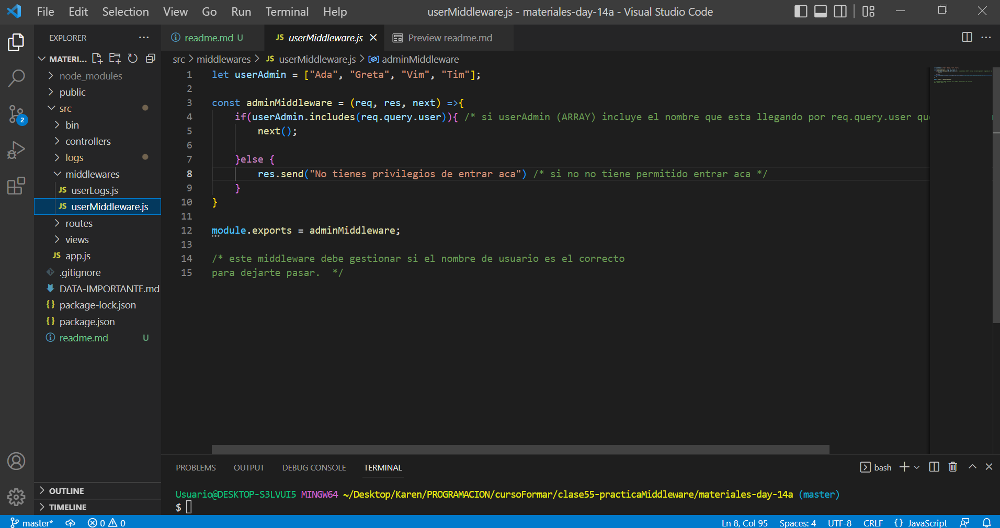

### Middlewares
####  👉 Qué es un middleware? 👈 
#### Es un "intermediario" entre el request y el response. Básicamente son funcionaes que se ejecutan en medio de la ejecución del pedido del cliente y la respuesta del mismo.  
#### Los middlewares nos permiten aislar código para ser reutilizado donde lo necesitemos. Todo esto agrega una capa de seguridad al sitio en desarrollo. 🔐🔐 Si la función que definimos como middleware no se cumple, cortará la ejecución del programa y devolverá la respuesta que seteamos para ese caso. 
#### Para esta actividad desarrollé un middleware que permitirá llevar un registro sobre el acceso a diferentes rutas, como un log para identificar a qué rutas se accedieron (algo como un historial). Además, agregé un middleware para restringir el ingreso a ciertas URL.
#### # Creado con express-generator
#### Un vistazo general: 
